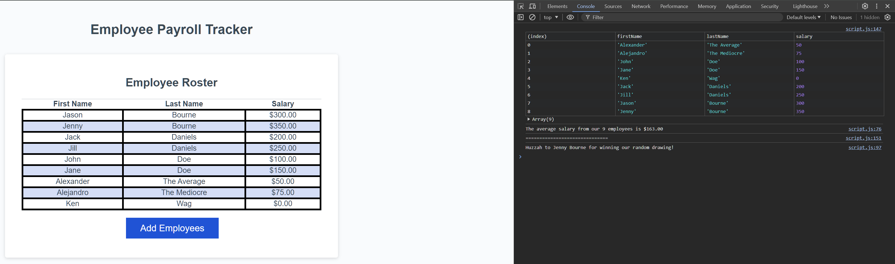

# Employee Payroll Tracker Starter Code

## Description

🥔 Potato Enterprises approached me to help setup a payrol wizard that they can run from a web browser. Whenever the payrol manager clicked the button it didn't do anything. I was excited to help, knowing that having a tool for them to enter the information and be able to view it in a pleasing way would be very beneficial. 

## Installation

NA

## Usage

To add employees's first name, last name, and salary via browser prompts to the table in the site click on the "Add Employee" button, then follow the prompts that pop open. The console will automatically display the average salary of all the entered employees and will automatically randomly select one of the employees for the drawing.

Link to the [Potato Payroll Wizard](https://horizonbound0.github.io/potato-payroll-wizard-Ken-W/)

Site Screenshot

## Credits

###Study Session Companions!
[David Evett](https://github.com/davidevett)
[Aileen Johnson](https://github.com/aileenej)

## License

This project uses the MIT License, and is available in the repo.